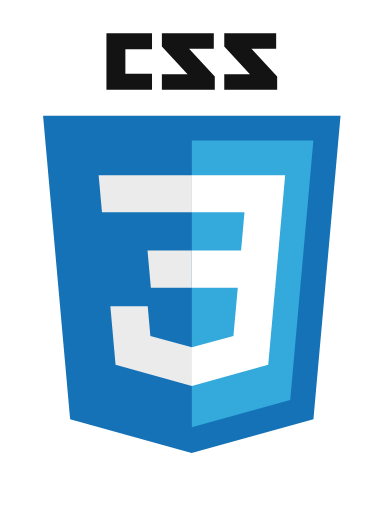

<h1 align="center">Hi 👋, I'm Ardhendu</h1>
<h3 align="center">A passionate full stack developer from India</h3>

  

  

🔭 I Have experience in various web technologies and UI /UX design, specializing in JS /TS frameworks like React.js and Next.js and HTML, CSS, Javascript, and Typescript. Besides frontend I also have a decent knowledge of the backend, I have done projects with Express js, and MongoDB. Also, know Java. 

🌱 I’m currently learning *Tailwind CSS*, *GraphQL*, and *Next.js*

🤝 I’m looking for **a Full-time Job as a Software Developer**

📫 How to reach me: ardhendujj002@gmail.com

⚡ Hobbies: I play cricket and football

<h3 align="center">Connect with me:</h3>

  

  
    
     

<h3 align="center">Languages and Tools:</h3>

  
  
  
  
   
  
  
  
  
  
   
  
  
  
 

  

  

